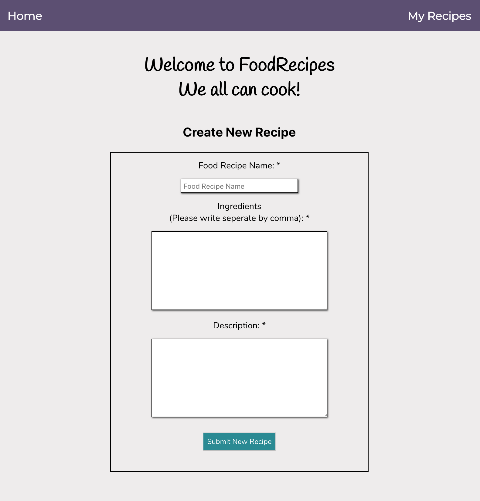

# App Name: FoodRecipes

This is project live page: [FoodRecipes](https://foodrecipes.now.sh/)

## About Application

"FoodRecipes" is an app for everyone who wants to cook for meals or desserts. 
If you cannot remember what is the recipes you can get detail recipes in the "FoodRecipes" app.
Share your favorite food recipes with other people who want to try your recipes.
You can try other people's recipes which you like or try it yourself.
We all can cook any country foods easily, and proud of ourselves when we eat cooked foods with family or friends nearby you.
The "FoodRecipes" app will be best food recipes friend for everyone in the world.

## Technical

Client: React.js, Javascript, HTML, and CSS
API Server: Express.js, Node.js, PostgreSQL, mocha, chai, and super test

FoodRecipes application base on browser router to handle the URL with using context syntax and connect primary components inside of src folder.

For any users, they can able to see all of food recipes with food name, ingredients and description.
If users don't like their recipes, they can remove anytime.
Also, when they are in 'Create New Recipe' page, users able to create new recipes anytime and what they want.

If you want to try to run this application locally, simply git clone the repos, and 'npm run start' both sides.
[Client](https://github.com/hskang135/Food-Recipes-Client) | [API Server](https://github.com/hskang135/Food-Recipes-Server) | [Heroku](https://whispering-dawn-16121.herokuapp.com/)

## Screenshots

Main Home Page

My Recipes Page

Created by Heesu Kang
